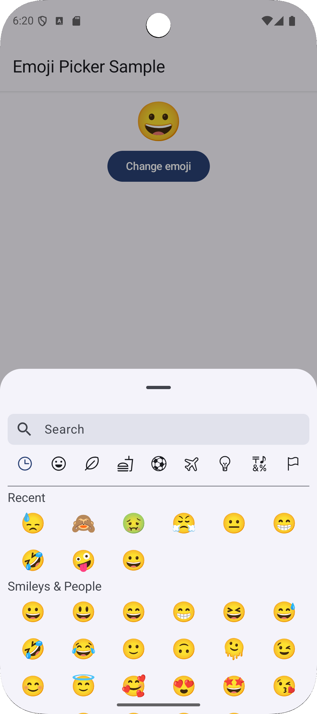
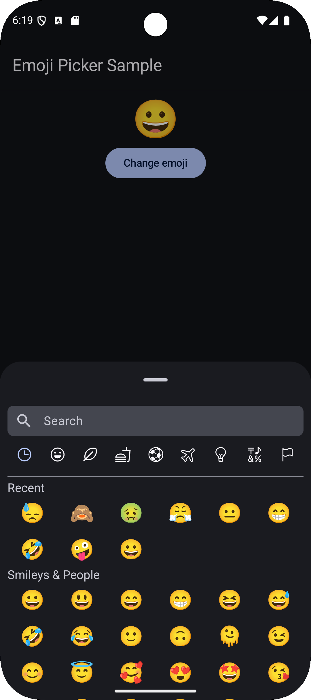

# 😀 Compose Emoji Picker

This library provides an **Emoji Picker** that is easy to integrate into any Android project built with Jetpack Compose. It allows users to quickly and intuitively select and insert emojis into the application.

## Features

- **😀 Support for all emojis**: Includes a wide range of emojis compatible with the latest Unicode standards.
- **🔎 Quick search**: Allows users to quickly search for emojis by category or name.
- **⌚ Recent emojis**: Displays a list of recently used emojis for quick access.
- **🌎 Multilingual support**: Supports both English and Italian languages for a more localized experience (in both UI and search).
- **📱 Full Jetpack Compose compatibility**: Designed to work seamlessly with Jetpack Compose-based apps.

## 🔎 Emoji Search Feature

Unlike other emoji picker libraries, this one allows you to search for emojis based on the language of the device. While many libraries support multiple languages for displaying emojis, they do not account for language differences during the emoji search process, resulting in an english-only search feature. This library ensures that when users search for emojis, the search results are tailored to the device's language settings, providing a more intuitive and localized experience. If library does not support the device's language, then english is used.

For the time being, EmojiPicker only supports 2 languages: English and Italian. If you want to contribute to this library to add more language support, feel free to open a pull request. Every contribution is welcome!

## ⚡ How to Use It

### 1. Add repository

Add `maven(url = "https://jitpack.io")` in your settings.gradle file, at the end of repositories:

```gradle
dependencyResolutionManagement {
    repositoriesMode.set(RepositoriesMode.FAIL_ON_PROJECT_REPOS)
    repositories {
        google()
        mavenCentral()
        maven(url = "https://jitpack.io")
    }
}
```

### 2. Add the dependency

To add the library to your project, include the following dependency in your `build.gradle` file:

```gradle
dependencies {
    implementation("com.github.alexdametto:compose-emoji-picker:<version>")
}
```

## 📖 Example Usage

You can integrate the Emoji Picker into your composable like this:

```kotlin
val openEmojiPicker: MutableState<Boolean> = remember {
    mutableStateOf(false)
}
val selectedEmoji: MutableState<String> = remember {
    mutableStateOf("😀")
}

EmojiPicker(
    open = openEmojiPicker.value,
    onClose = {
        openEmojiPicker.value = false
    },
    onEmojiSelected = {
        selectedEmoji.value = it.emoji
        openEmojiPicker.value = false
    }
)
```

For a more complete example, check out the [sample project](sample-app/src/main/java/dev/alexdametto/compose_emoji_picker/SampleActivity.kt).

## ✨ Theming

This library fully supports both **Light** and **Dark** modes, automatically adapting to the colors defined in your **Material 3** theme. This ensures that the emoji picker seamlessly matches colors specified in your app's theme. Whether the user is in light or dark mode, the picker will adjust dynamically to provide a consistent and polished experience, aligning perfectly with the overall design of your app.

Below are examples of the emoji picker in both Light and Dark modes:

<p float="left">
    
    &nbsp; &nbsp; &nbsp; &nbsp;
    
</p>

## 🔗 Contribute

If you'd like to contribute to this library, feel free to open a pull request or report an issue. Any contribution is welcome!
